# Building Trustworthy AI Agents

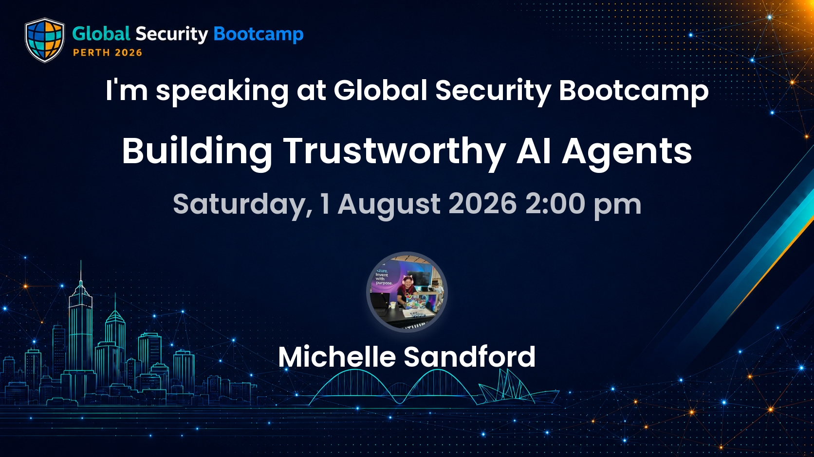{ .hero-image }

This companion site follows the **Global AI Security Bootcamp 2026** talk and turns the deck into readable, accessible chapters — one page per slide, with expanded explanations and real-world examples.

<a class="chapter-card" href="slide-01-title/">
  
  <h2>Slide 1 · Title</h2>
  
Why security professionals are the most important people in the room.

</a>

<a class="chapter-card" href="slide-02-vibe-shift/">
  
  <h2>Slide 2 · The Vibe Shift</h2>
  
From "AI in your app" to "your app IS the agent" — and why your skills are more relevant than ever.

</a>

<a class="chapter-card" href="slide-03-agenda/">
  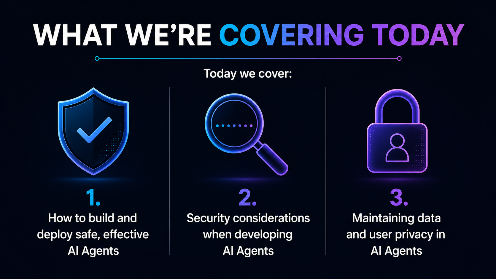
  <h2>Slide 3 · What We're Covering</h2>
  
Three practical topics: safe deployment, security considerations, and data privacy.

</a>

<a class="chapter-card" href="slide-04-what-is-an-agent/">
  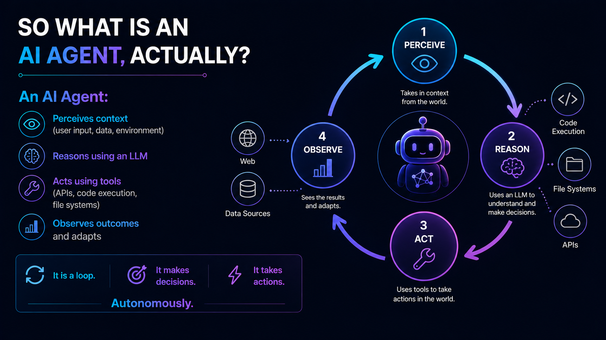
  <h2>Slide 4 · What Is an AI Agent?</h2>
  
The Perceive → Reason → Act → Observe loop, and why every step is an attack surface.

</a>

<a class="chapter-card" href="slide-05-agent-spectrum/">
  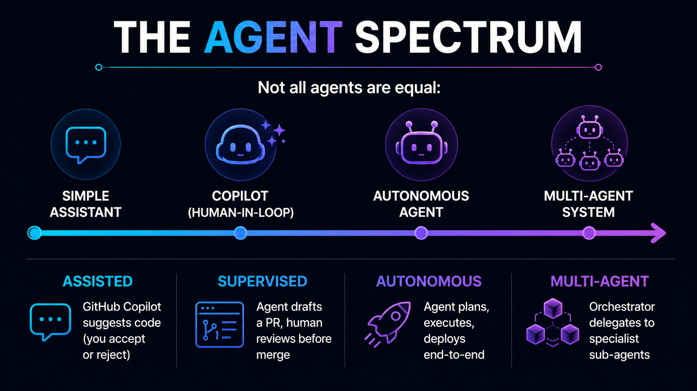
  <h2>Slide 5 · The Agent Spectrum</h2>
  
From assisted to multi-agent — and why your security posture must match your autonomy level.

</a>

<a class="chapter-card" href="slide-06-cloud-native-sdlc/">
  
  <h2>Slide 6 · Cloud-Native Agents in the SDLC</h2>
  
Agents across every phase of delivery — and the security considerations at each stage.

</a>

<a class="chapter-card" href="slide-07-threat-landscape/">
  
  <h2>Slide 7 · The Threat Landscape</h2>
  
The real numbers, OWASP's LLM Top 10, and why autonomy changes the blast radius.

</a>

<a class="chapter-card" href="slide-08-owasp-threats/">
  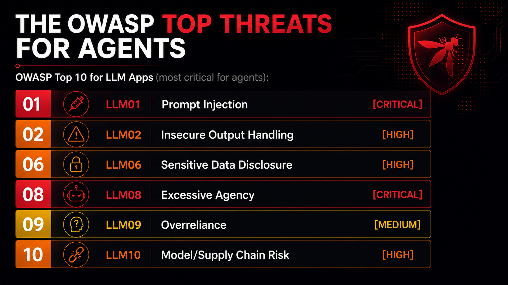
  <h2>Slide 8 · OWASP Top Threats for Agents</h2>
  
Six critical risks — prompt injection, excessive agency, supply chain — with examples and mitigations.

</a>

<a class="chapter-card" href="slide-09-prompt-injection/">
  
  <h2>Slide 9 · Prompt Injection: Show Don't Tell</h2>
  
Vulnerable vs. defended side by side — and why architectural controls beat prompt controls.

</a>

<a class="chapter-card" href="slide-10-attack-surface/">
  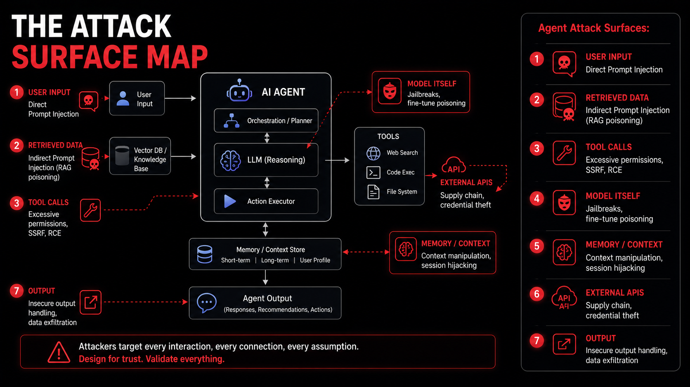
  <h2>Slide 10 · The Attack Surface Map</h2>
  
Every attack surface an agent presents, with real-world examples and targeted defences.

</a>

<a class="chapter-card" href="slide-11-framework-overview/">
  
  <h2>Slide 11 · Framework Overview</h2>
  
The five-layer Trustworthy Agent Stack and what breaks when each layer is missing.

</a>

<a class="chapter-card" href="slide-12-secure-design/">
  
  <h2>Slide 12 · Layer 1 — Secure Design</h2>
  
STRIDE applied to agents, the five questions every developer must answer before deployment.

</a>

<a class="chapter-card" href="slide-13-identity-least-privilege/">
  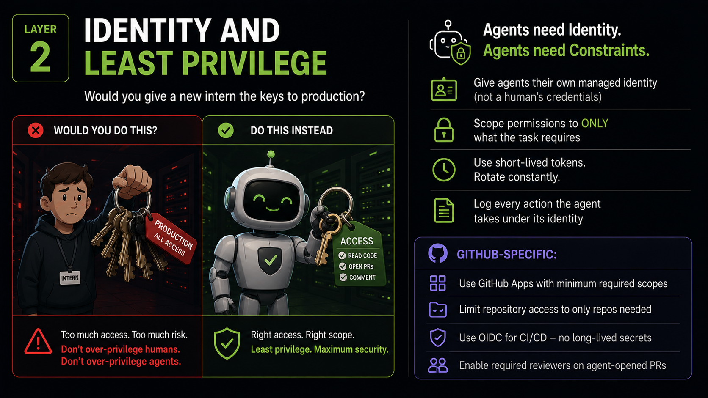
  <h2>Slide 13 · Layer 2 — Identity &amp; Least Privilege</h2>
  
GitHub Apps, OIDC, required reviewers — and why agents must never authenticate as humans.

</a>

<a class="chapter-card" href="slide-14-runtime-controls/">
  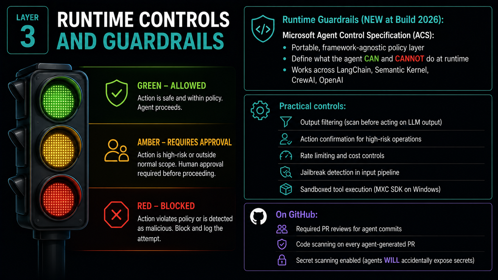
  <h2>Slide 14 · Layer 3 — Runtime Controls</h2>
  
The Agent Control Specification, output filtering, rate limiting, and GitHub as a guardrail.

</a>

<a class="chapter-card" href="slide-15-observability/">
  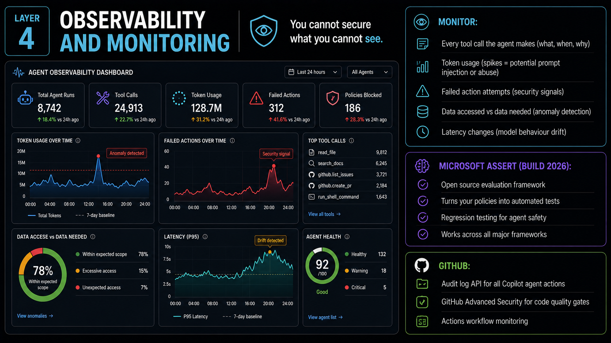
  <h2>Slide 15 · Layer 4 — Observability</h2>
  
What to monitor, why token spikes are security signals, and how ASSERT works.

</a>

<a class="chapter-card" href="slide-16-governance/">
  
  <h2>Slide 16 · Layer 5 — Governance</h2>
  
The Agent Policy Document, Microsoft IQ, the EU AI Act, and governance as a deployment enabler.

</a>

<a class="chapter-card" href="slide-17-live-demo/">
  
  <h2>Slide 17 · Live Demo</h2>
  
All five security layers in action — identity, code scanning, secret scanning, review gates, audit logs.

</a>

<a class="chapter-card" href="slide-18-developer-ally/">
  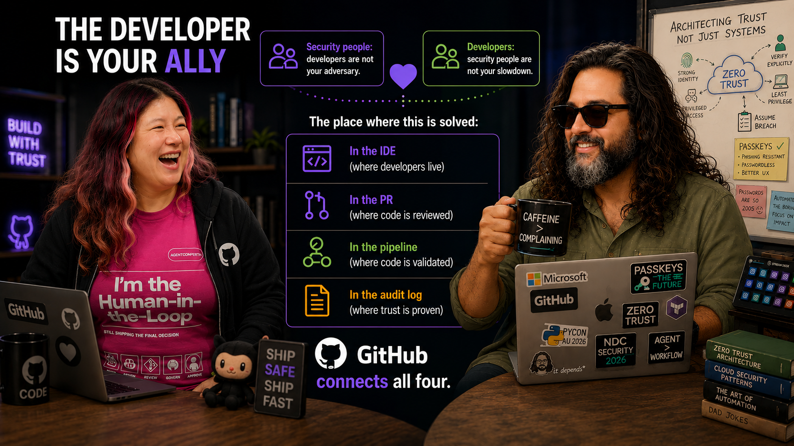
  <h2>Slide 18 · The Developer Is Your Ally</h2>
  
Security in the IDE, the PR, the pipeline, and the audit log — and why the secure path must be the easy path.

</a>

<a class="chapter-card" href="slide-19-checklist/">
  
  <h2>Slide 19 · Agent Security Checklist</h2>
  
The full pre-production checklist — design, identity, code, runtime, observability, governance.

</a>

<a class="chapter-card" href="slide-20-closing/">
  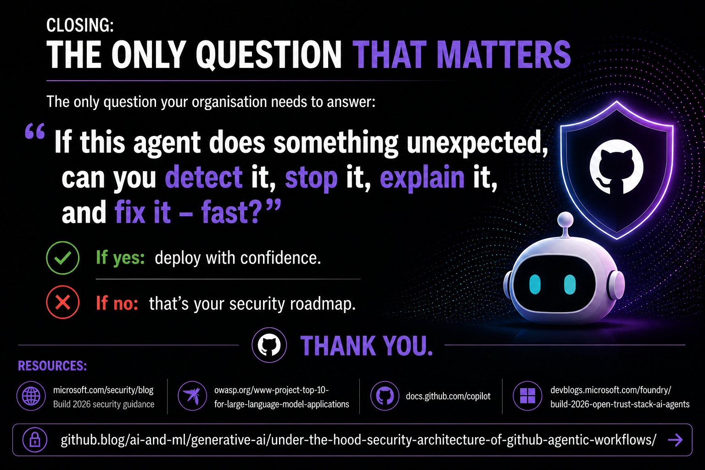
  <h2>Slide 20 · The Only Question That Matters</h2>
  
Can you detect it, stop it, explain it, and fix it — fast? That is your security roadmap.

</a>

