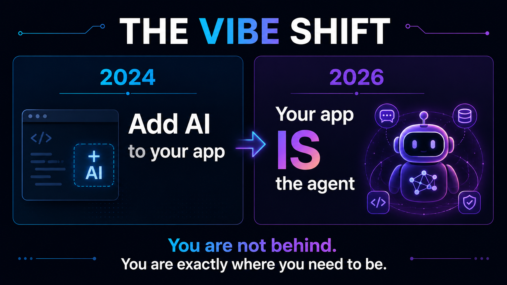

# Slide 2 · The Vibe Shift

{ .hero-image }

## 2024: Adding AI to Your App

In 2024, the dominant pattern was integration. You had an existing application - a SaaS product, an internal tool, a mobile app - and the strategic move was to add AI capabilities to it. This usually meant one or more of:

- **A chat interface:** A "Chat with your data" feature powered by a RAG pipeline and an LLM.
- **Smart suggestions:** Copilot-style autocomplete in forms, code editors, or search boxes.
- **Content generation:** Using LLMs to draft summaries, write descriptions, or produce reports.
- **Intelligent search:** Semantic search replacing keyword-based queries.

The security model for this era was relatively tractable. The AI component was contained - it received input, produced output, and a human decided what to do with that output. The blast radius of a compromised or misbehaving model was limited.

## 2026: Your App IS the Agent

By 2026, the model has inverted. The most strategically significant AI deployments are no longer features *within* a product - they are the product itself. An agent does not wait for a human to click "apply." It:

- **Plans:** Decomposes a high-level goal into a sequence of tasks.
- **Executes:** Calls tools - APIs, code executors, file systems, databases - to complete those tasks.
- **Decides:** Chooses which action to take next based on the observed outcome of the last action.
- **Loops:** Repeats this until the goal is achieved, a limit is reached, or a human intervenes.

**Concrete examples from 2026:**

- A **GitHub Copilot coding agent** that accepts a GitHub Issue, writes the implementation, opens a pull request, and responds to review comments - autonomously, with no human triggering each step.
- A **customer support agent** that reads a complaint email, looks up the account in a CRM, applies a refund policy, issues the refund, and sends a confirmation - end to end without a human in the loop.
- A **security operations agent** that detects an anomaly in logs, queries threat intelligence feeds, assesses blast radius, and files an incident ticket with a remediation recommendation - all within seconds of the alert firing.

## The Security Implications of the Inversion

In the 2024 model, the AI is a *tool* a human wields. In the 2026 model, the AI is an *actor* in your systems. That distinction changes the entire security calculus.

A misconfigured chatbot gives a wrong answer. A misconfigured agent with write access to your repository, CI pipeline, and production environment can make changes that are difficult or impossible to reverse. The surface area has expanded. The autonomy has increased. The speed of potential damage has accelerated.

This is not a reason to avoid agents - it is a reason to build them correctly.

## You Are Not Behind

The most important message for security professionals facing this shift: **you are exactly where you need to be.**

Every security discipline you have built - threat modelling, access control, audit logging, incident response - maps directly to the challenges of securing agentic systems. The principles do not change. The application does. And understanding that application is what this session is about.

The security fundamentals you already know? They are *more* relevant now than ever. You are not behind. You are the most important person in the room when it comes to getting this right.

[← Back: Slide 1](slide-01-title.md)
[Next: Slide 3 →](slide-03-agenda.md)

