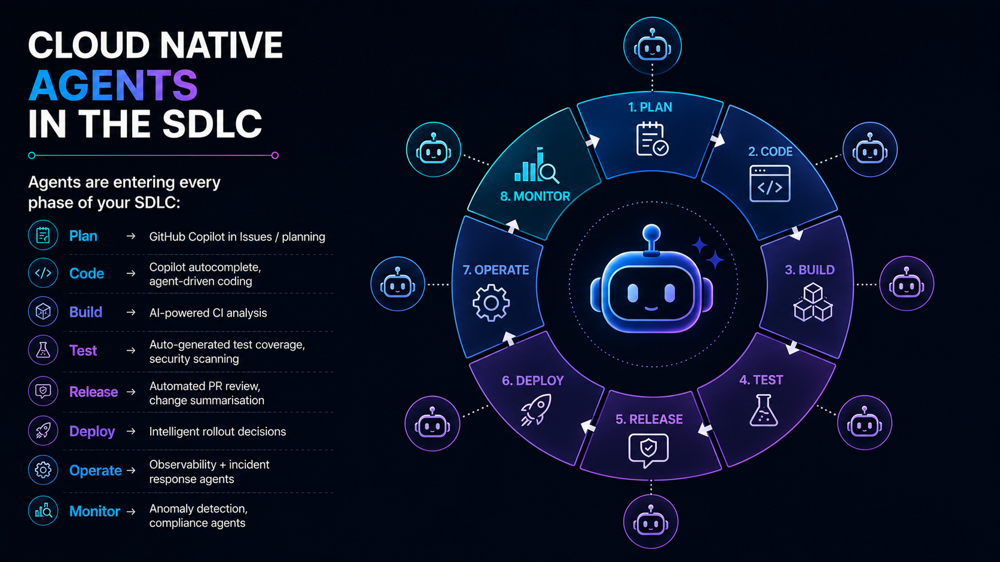

# Slide 6 · Cloud-Native Agents in the SDLC

Agents are entering every phase of your software delivery lifecycle. That is simultaneously the most exciting and the most important security story in enterprise software today.

{ .hero-image }

## The SDLC, Transformed

### Plan
**What agents do here:** GitHub Copilot can analyse a feature request in an Issue, break it down into implementation tasks, identify dependencies on existing code, and suggest an approach. It can reference similar past work in the codebase to inform estimates and flag known complexity areas.

**Security consideration:** Agents reading planning documents have access to roadmap information, API designs, and architectural decisions. Scope their read access carefully. A planning agent does not need access to the production secrets store. Treat it as you would a contractor with a short-term engagement: access only to what is needed for the specific work, with clear revocation when the engagement ends.

---

### Code
**What agents do here:** Autocomplete, full function generation, test scaffolding, refactoring suggestions, and — with coding agents — full feature implementation from an Issue description.

**Security consideration:** Generated code must be scanned for vulnerabilities and hardcoded credentials before it merges. Code scanning should be automatic and mandatory on every agent-opened PR, not optional. This is not distrust of the agent — it is the same standard you apply to human-written code. An agent generating a database access layer may inadvertently produce SQL without parameterised queries. A code scanner catches it.

---

### Build
**What agents do here:** AI-powered CI analysis identifies flaky tests, detects which changed files are likely to cause build failures before the full build runs, and prioritises test execution to surface failures faster.

**Security consideration:** Agents interacting with build pipelines need tightly scoped permissions. A build analysis agent that needs to read test results does not need write access to the repository or the ability to trigger deployments. Separate your read-only analysis functions from your read-write execution functions, and assign distinct identities to each.

---

### Test
**What agents do here:** Auto-generate unit tests and integration tests based on code changes. Run security-specific test suites (fuzzing, DAST scans) autonomously on new builds. Generate test coverage reports and identify untested paths.

**Security consideration:** Test generation agents have read access to all code under test. This may include sensitive business logic, authentication flows, cryptographic implementations, and data models. Treat them as you would any service account with broad read access — logged, scoped, and auditable. Ensure test outputs (which may contain assertions about real data values) are handled as potentially sensitive.

---

### Release
**What agents do here:** Automated PR review and summarisation. Change impact analysis against previous releases. Release notes generation from commit history and PR descriptions.

**Security consideration:** Agents reading diffs and generating summaries for human reviewers must not suppress security-relevant findings. An agent that summarises a PR as "minor refactor" when the diff contains a security-relevant change could undermine human review quality. Consider requiring that agent-generated PR summaries include an explicit "security-relevant changes" section, even when the agent identifies none.

---

### Deploy
**What agents do here:** Intelligent rollout decisions — canary deployments, progressive traffic shifting, automated rollback when error rates spike. Feature flag management. Deployment gate evaluation (has the security scan passed? are all required approvals in place?).

**Security consideration:** Deployment agents need very tightly scoped permissions. An agent that can trigger a rollout should not also be able to modify infrastructure definitions. Separate deployment execution from deployment configuration. The principle: agents that take actions in production should have the minimum permissions for the specific deployment action and nothing more.

---

### Operate
**What agents do here:** Observability analysis, runbook automation, incident triage, and first-response actions (restarting unhealthy services, scaling compute, isolating compromised hosts).

**Security consideration:** Operational agents often need broad read access to logs, metrics, and system state. Ensure data retention and access logging policies cover agent access as thoroughly as human access. Agents reading production logs may encounter PII, credentials accidentally included in log output, and detailed system internals. Data minimisation at the log collection layer protects both privacy and security.

---

### Monitor
**What agents do here:** Continuous anomaly detection, compliance posture reporting, threat detection correlation, security finding prioritisation.

**Security consideration:** Monitoring agents process some of the most sensitive data in your organisation — security findings, access logs, threat indicators, user behaviour patterns. Access to monitoring data must be as tightly controlled as access to the production systems being monitored. A compromised monitoring agent is particularly dangerous because it can suppress alerts or manipulate the signals that human responders rely on.

---

## The Shift-Left Imperative for Agent Governance

Shift left — the principle that security problems caught earlier in the SDLC are cheaper and less risky to fix — is not a new idea. But in the age of agents, it extends beyond vulnerability scanning.

**Governance must begin at the planning stage.** Defining what an agent is allowed to do, how it will be identified, what data it can access, and what human oversight gates apply — these are planning decisions, not deployment decisions. An agent that reaches the deployment stage without a clear identity design, permission scope, and audit logging plan is being deployed without its security architecture.

**GitHub is at the centre of this story** because GitHub is where code lives and where the SDLC is orchestrated. Branch protection rules, required reviews, code scanning, secret scanning, and audit logging are the governance layer for the entire pipeline. When agents work through GitHub — opening PRs, pushing commits, commenting on Issues — those controls apply to everything they do. Your pipeline is your agent guardrail. Build it right, and it enforces policy on every agent action that matters.

[← Back: Slide 5](slide-05-agent-spectrum.md)
[Next: Slide 7 →](slide-07-threat-landscape.md)

