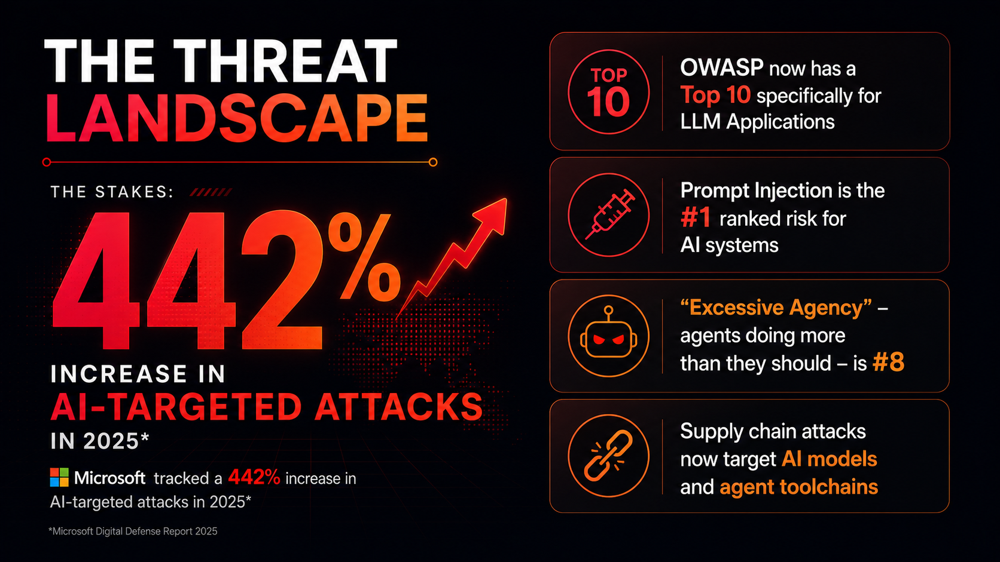

# Slide 7 · The Threat Landscape

The numbers are real. The risks are documented. The time to take this seriously is now.

{ .hero-image }

## The Stakes

The threat landscape for AI agents is not speculative. In 2025, Microsoft tracked a **442% increase in AI-targeted attacks** — not attacks *using* AI, but attacks *targeting* AI systems. That number reflects how rapidly adversaries have identified that AI pipelines are a high-value target. The attack surface is new. The attackers already know it exists.

## Why Agents Raise the Stakes Dramatically

A prompt injection attack against a chatbot is embarrassing. The model says something it shouldn't. A human reads it, frowns, and reports it. The blast radius is a bad response in a UI.

A prompt injection attack against an agent with write access to your code repository, CI pipeline, and production deployment pipeline is a breach. The agent acts on the injected instruction. Code is modified. Secrets are exfiltrated. Deployments are triggered. All of this can happen within the time it takes the model to complete one reasoning loop — seconds.

**The difference is autonomy plus permissions.** When you give an AI system the ability to take consequential, automated actions, every vulnerability in that system has a blast radius proportional to its permission set. That is the core insight that should drive every decision you make about agent security.

## OWASP's Top 10 for LLM Applications

OWASP — the Open Web Application Security Project, whose top 10 web application security risks are a foundational reference for the industry — now maintains a dedicated Top 10 list for Large Language Model applications.

This list did not emerge from threat modelling sessions. It emerged from documenting attacks that had already been observed against real systems. These vulnerabilities are exploited in the wild. They are not theoretical.

What is remarkable about the LLM Top 10 is how familiar many of the attack classes are to anyone with a background in application security. Injection, excessive privilege, insecure output handling, supply chain risk — we have seen these before. What is new is the medium, the surface area, and the speed.

## The Three That Matter Most for Agents

### Prompt Injection — OWASP LLM01: CRITICAL

Ranked first because it is the most broadly exploitable, the hardest to fully remediate at the prompt level, and the most dangerous when an agent has elevated permissions.

There are two forms:

**Direct prompt injection:** The attacker controls the user input and crafts it to override the agent's system instructions. Like SQL injection against user input fields, but targeting the model's instruction context rather than a database query parser.

**Indirect prompt injection:** The attacker embeds malicious instructions in content the agent will *read* during its normal operation — a web page it browses, a document it retrieves from storage, an email it processes, a GitHub Issue it analyses. When the agent processes that content, the injected instructions execute as if they were legitimate context. This is the variant that keeps security teams awake at night, because the agent is doing exactly what it was designed to do (read content) — the content is just adversarial.

### Excessive Agency — OWASP LLM08: CRITICAL

This is the risk that does not come from an external attacker. It comes from an agent that was given more permissions than it needed for its defined function. When that agent makes a mistake — when it misinterprets a goal, when it is successfully manipulated by an injection attack, when it encounters an edge case its designers did not anticipate — the consequence is limited only by what it was allowed to do.

An agent scoped to read Issues and post comments can, at worst, post an unwanted comment. An agent with write access to the main branch, the secrets store, and the deployment pipeline can, at worst, cause a production outage or a data breach. Excessive agency is a design choice. It is entirely preventable.

### Supply Chain Risk — OWASP LLM10: HIGH

The agent toolchain is a supply chain. The model itself, the orchestration framework, the tool integrations, the MCP servers the agent calls, the fine-tuning dataset — each is a dependency. Each can be compromised.

A malicious MCP server can return responses that inject instructions into the agent's context. A compromised model fine-tune can introduce backdoors that activate on specific trigger phrases. A third-party tool integration with a vulnerability in its authentication can allow credential theft.

Your agent is only as trustworthy as the least trustworthy component in its chain.

## The Good News

Almost every category in the LLM Top 10 has a known mitigation. None of these risks require accepting agent capabilities without security controls. The following slides cover the specific defences for the most critical vulnerabilities, and the framework for building agents that are secure by design, not by luck.

[← Back: Slide 6](slide-06-cloud-native-sdlc.md)
[Next: Slide 8 →](slide-08-owasp-threats.md)

