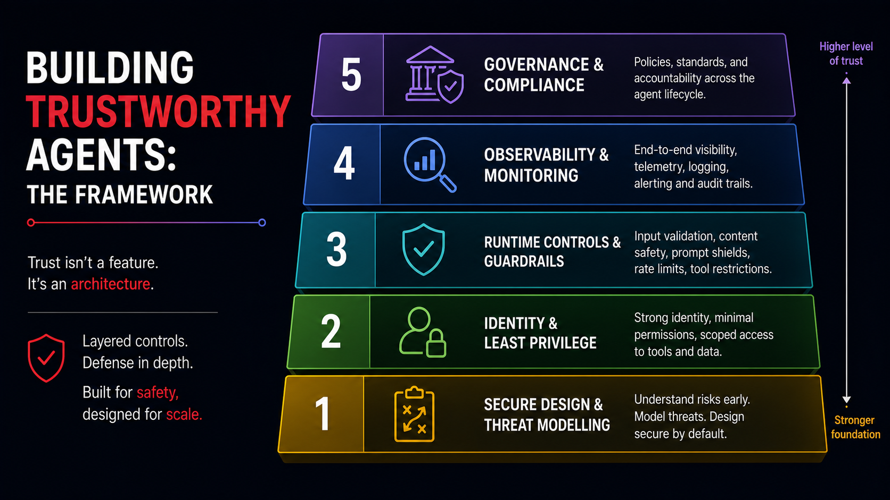

# Slide 11 · Building Trustworthy Agents: The Framework

Build trustworthy agents with layered controls, not a single safeguard.

{ .hero-image }

## The Trustworthy Agent Stack

Think of trustworthy agent design like a layered architecture. Each layer builds on the one below it. A failure at a lower layer cannot be fully compensated for by controls at a higher layer - just as a building with a cracked foundation cannot be made safe by adding a stronger roof.

```
[5]  Governance & Compliance
[4]  Observability & Monitoring
[3]  Runtime Controls & Guardrails
[2]  Identity & Least Privilege
[1]  Secure Design & Threat Modelling
```

This is not a proprietary framework. It reflects a convergence across the industry - including Microsoft's Open Trust Stack announced at Build 2026 - toward layered, interoperable trust controls that work regardless of which AI framework underlies the agent.

## What Happens When You Skip a Layer

The value of the layered model becomes clear when you think through what breaks when each layer is absent:

**No Layer 1 (Secure Design):** The agent is built with unnecessary permissions, no threat model, and attack surfaces no one has considered. Every subsequent layer is compensating for design failures rather than enforcing a strong baseline. Retrofitting security design after an agent is in production is significantly more expensive than building it in from the start.

**No Layer 2 (Identity and Least Privilege):** The agent acts under an overly broad identity with excessive permissions. When it is successfully manipulated by a prompt injection or makes a logic error, the blast radius is the size of its permissions - not the size of the task it was performing.

**No Layer 3 (Runtime Controls):** The agent can take any action the model decides on, with no policy enforcement at execution time. A successful injection at the model level translates immediately into unrestricted action. There is no architectural barrier between a manipulated model decision and a harmful outcome.

**No Layer 4 (Observability):** When something goes wrong - and at sufficient scale, something always eventually goes wrong - you cannot determine what the agent did, when, why, or in response to what input. Incident response is guesswork. Compliance audit is impossible. You cannot learn from failures you cannot see.

**No Layer 5 (Governance):** You cannot prove the agent behaved correctly. You cannot demonstrate compliance to a regulator. You cannot explain agent decisions to affected users. You have no documented accountability for agent actions. The agent cannot be deployed in any regulated context or any context where trust must be demonstrated.

## Microsoft's Open Trust Stack

At Build 2026, Microsoft announced the **Open Trust Stack for AI Agents** - a framework for building agent trust that is explicitly designed to be open and interoperable, not tied to any specific vendor's platform.

The Open Trust Stack identifies five requirements for a trustworthy agent:

1. **Identity** - the agent has a verifiable, distinct identity. Every action is attributable to a specific non-human principal.
2. **Context** - the agent's behaviour is bound by the specific context of each task. Permissions do not persist beyond their intended scope.
3. **Control** - policy is enforced at runtime, not just in documentation or system prompts.
4. **Observability** - a complete, auditable record of the agent's actions exists and can be queried.
5. **Accountability** - a human or organisational entity owns responsibility for the agent's behaviour and its consequences.

These five requirements map directly to the five layers. The next five slides examine each layer in detail - with specific tools, patterns, and GitHub-native implementations for each.

## The Foundation: Shift Left

The most important principle before the framework begins: **security problems caught earlier in the design process are cheaper, simpler, and more complete to fix than problems discovered in production.**

For AI agents, "shift left" means:
- Threat modelling happens before the first line of agent code is written.
- Permission scopes are defined before the agent is built, not after.
- Audit logging is part of the architecture, not an afterthought.
- Governance documents are approved before deployment, not as a retrospective exercise.

The five-layer framework is most effective when the lower layers are addressed first and the higher layers build on them - not when they are applied in reverse as remediation for a deployed agent.

<div class="chapter-nav" markdown>
[← Back: Slide 10](slide-10-attack-surface.md)
[Next: Slide 12 →](slide-12-secure-design.md)
</div>
