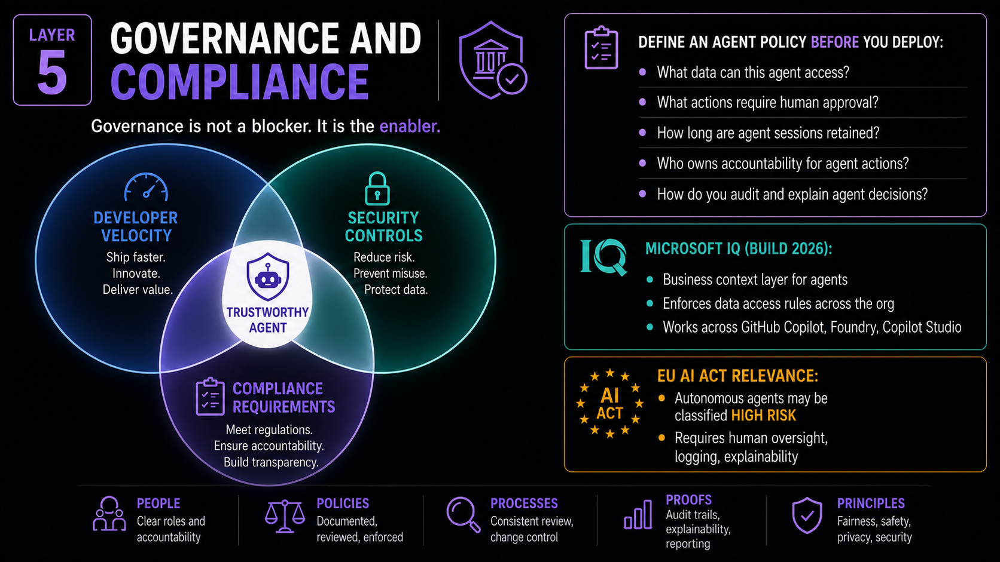

# Slide 16 · Layer 5: Governance and Compliance

Governance is not the process that slows you down. It is the evidence that lets you deploy with confidence.

{ .hero-image }

## Reframing Governance

The word "governance" produces a predictable reaction in most development teams: eyes glaze. It sounds like paperwork, process, and friction. Specifically, it sounds like someone is about to create a committee and schedule a quarterly review meeting.

Let me offer a different frame.

Governance is the answer to a question your CISO will ask, that your legal team will ask, and - increasingly - that your regulators will ask: **"Can you prove what that agent did and why?"**

Without governance, the answer is no. And an agent you cannot account for is an agent you cannot deploy in any regulated or high-trust context. Governance is not your enemy. It is your deployment ticket.

More than that: organisations with strong governance move **faster** than those without it. Security reviews take less time when the evidence already exists. Legal sign-off is faster when the data handling is documented. Customer due diligence is simpler when the audit trail is demonstrable. Governance converts security investment into deployment velocity.

## The Agent Policy Document

Before any agent reaches production, an Agent Policy Document should exist and be approved by the relevant stakeholders (security, legal, privacy). It is not a long document. It answers five questions:

**1. What data can this agent access?**
List every data source. Classify the sensitivity level of each. For each source, document whether the access is read, write, or both - and whether that level is strictly required. Define data minimisation rules: what data the agent may retain, for how long, and in what form.

**2. What actions require human approval?**
Not a generic "significant actions require review." Specific action types, enumerated: *"Merging any PR to the main branch requires approval from at least one member of the engineering team."* *"Any action that modifies a file in the /config directory requires security team approval."* These gates must be technically enforced, not just stated as policy.

**3. How long are agent sessions and logs retained?**
Agent logs may contain sensitive data: user inputs, retrieved document content, tool call parameters and responses. Data retention obligations apply to agent logs with the same force they apply to other operational data. Define and enforce retention periods. Apply access controls to who can read logs.

**4. Who owns accountability for agent actions?**
Not the agent. A specific human, team, or role must be named as accountable for the agent's decisions and their consequences. When the agent causes harm - through error, manipulation, or unexpected behaviour - who is responsible for the remediation? Who communicates to affected users? Accountability must be assigned before the incident, not after.

**5. How do you audit and explain agent decisions?**
If a regulator, a lawyer, or an affected user asks *"why did your agent do X?"*, you must be able to answer with specifics: what input the agent received, what it reasoned, what it decided, what it did, in a human-readable format. This requires the observability infrastructure from Layer 4 to be in place before deployment.

## Microsoft IQ

Microsoft IQ, announced at Build 2026, addresses a governance challenge that is particularly acute in large organisations: **consistent data access policy enforcement across many agent deployments**.

When many teams are independently deploying agents, each team makes its own decisions about what data the agent can access. The result is governance fragmentation - some agents are carefully scoped, others have overly broad access, and there is no organisational visibility into the aggregate.

Microsoft IQ provides a business context layer that:
- Defines data access policies at the organisational level.
- Enforces those policies across all agent deployments, regardless of which framework or platform the agent uses.
- Works across GitHub Copilot, Azure AI Foundry, and Copilot Studio.

The principle it implements is important beyond the specific tool: **data governance for agents should be a platform-level concern, not a per-agent configuration decision.** Just as your organisation has consistent access controls for production databases that all applications must follow, agent data access should be governed by organisational policy rather than individual team judgment.

## The EU AI Act: Agents in Scope

For organisations operating in Europe or processing data of European residents, the **EU AI Act** is directly relevant to autonomous agent deployments.

The Act classifies AI systems by risk level. Autonomous agents operating in certain high-stakes domains may be classified as **high-risk AI systems**. The determination is based on the domain of deployment and the nature of decisions made:

- Recruitment and HR decision-making
- Critical infrastructure management
- Access to essential services (credit, insurance, benefits)
- Education and vocational training
- Law enforcement and justice
- Biometric identification

For agents classified as high-risk, compliance requires:

- **Human oversight mechanisms:** Technical controls ensuring that qualified humans can monitor, intervene, and override the system at any time.
- **Comprehensive audit logging:** Complete, durable records of the system's inputs, decisions, and outputs - sufficient to enable post-hoc accountability.
- **Explainability:** The ability to provide a meaningful explanation of the system's decisions to affected individuals, in accessible language.
- **Data governance:** Documented data handling practices, minimisation, and retention policies.
- **Incident reporting:** Serious malfunctions or incidents involving high-risk AI systems must be reported to national authorities.

Even for agents that fall below the high-risk threshold, these requirements define the direction of travel for industry standards. Implementing them now - for any agent that makes consequential decisions - is both a risk management and a competitive positioning decision.

## Practical Governance: Starting This Week

You do not need to build a comprehensive governance framework before deploying your first agent. Start with these five steps, and build from there:

1. **Name an owner** for every agent in production today. The ownership is human. If no one can answer *"who is responsible for this agent's behaviour?"*, the answer is no one - and that is a governance gap.

2. **Create an Agent Register** - a simple spreadsheet or Issues-based tracker listing every deployed agent: its purpose, its permissions, its data sources, its owner, and its deployment date. Visibility comes before control.

3. **Write one Agent Policy Document** for your most critical agent. Use the five questions above as the template. Getting one done creates the pattern for all subsequent agents.

4. **Enable audit logging** on all agent identities immediately. GitHub Apps generate audit log entries automatically. For other platforms, verify that agent actions are captured in your observability infrastructure.

5. **Define your incident response procedure for agent failures.** What do you do when an agent takes an unintended action? Who is notified? What is the containment step? How do you disable the agent quickly? This procedure should be written, known to the team, and tested before you need it.

[← Back: Slide 15](slide-15-observability.md)
[Next: Slide 17 →](slide-17-live-demo.md)

