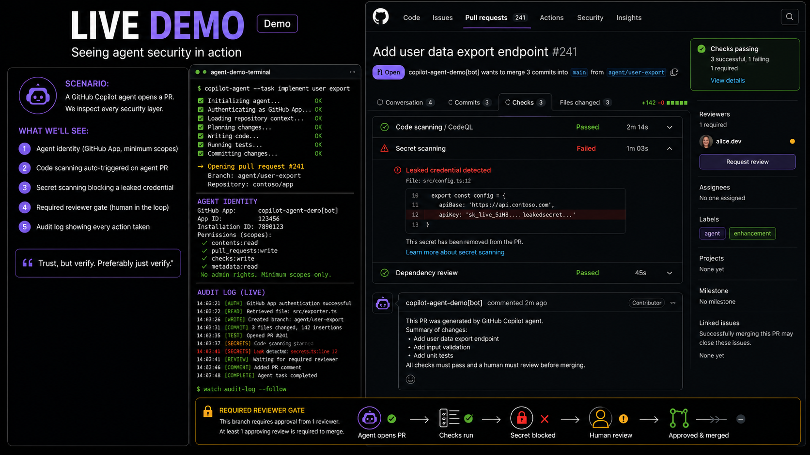

# Slide 17 · Live Demo

Seeing agent security in action - because if it doesn't run in real life, it doesn't count.

{ .hero-image }

## The Demo Scenario

The demonstration puts a GitHub Copilot coding agent to work in a real repository, with all five layers of the Trustworthy Agent Stack active and visible. The goal is not to show a perfect agent - it is to show that **the security controls work, including when the agent makes a mistake**.

The scenario:

> *A GitHub Copilot coding agent is asked to implement a feature from an Issue. We watch it work. Then we watch each security layer catch a problem - and explain exactly why that layer matters.*

## What the Demo Shows

### Layer 2 in Action: Agent Identity

The agent opens a pull request. Look at the PR author: it is not a human GitHub username. It is the GitHub App identity representing the agent - a named, non-human principal with a distinct avatar, its own audit trail, and permissions scoped specifically to this task.

**What this proves:** Agent actions are attributable. When you open the organisation's audit log, you see *"pr-implementation-agent opened PR #234 in repository acme-corp/api at 14:32 UTC"* - not the developer's account, not a shared service account. A named, accountable principal.

**Why it matters in practice:** When an incident occurs and the investigation asks *"what did the agent do?"*, the audit log answers the question precisely. Without a distinct agent identity, the answer is *"something happened under your account"* - which is not an acceptable answer to an audit, an incident review, or a regulator.

---

### Layer 3 in Action: Code Scanning Auto-Triggered

Within seconds of the PR being opened, GitHub Advanced Security automatically triggers a code scan of the agent's changes. No human intervened. No human clicked "start scan." The scan ran because it is a required status check on the branch - which means the PR **cannot be merged** until the scan completes and passes.

The scan results appear in the PR's Checks tab: every finding, its severity, its location in the diff, and the rule that triggered it.

**What this proves:** Agent-generated code receives the same automated security scrutiny as human-generated code. There is no expedited path, no assumption that because an AI wrote the code it must be secure. The same standard applies.

**Why it matters in practice:** Code generation models, including sophisticated ones, produce code with security vulnerabilities. Not always. Not even frequently. But at sufficient volume, they will. An agent making 100 code changes a day without automated scanning will eventually merge a vulnerability. Code scanning on every PR is the control that makes this catch rate approach 100%.

---

### Layer 3 in Action: Secret Scanning Catches a Leaked Credential

In the demo, the agent's generated code includes a hardcoded API key - deliberately seeded for the demonstration. This is not contrived: agents generating code that interacts with external services do accidentally include credentials in their output. It happens in production.

**GitHub blocks the push before the commit reaches the repository.** Secret scanning with push protection is active, and the push containing the leaked credential is rejected at the git level with a message explaining what was detected and how to remediate.

**What this proves:** The security system catches agent mistakes that would create a credential exposure incident. The developer does not need to remember to review every line of agent output for credentials - the automated system catches it before it matters.

**Why it matters in practice:** A credential in a GitHub repository - even briefly, even if quickly removed - is typically already compromised. GitHub's push protection prevents it from landing in the repository in the first place. For agents, which may be generating code at high volume, this control is not a nice-to-have - it is essential.

---

### Layer 2 + 3 in Action: The Required Reviewer Gate

Even after code scanning passes and no secrets are detected - all the automated checks are green - **the merge button remains disabled**. Branch protection requires at least one human reviewer to approve the PR before it can merge.

More importantly: **the agent identity itself is excluded from the set of valid approvers.** An agent cannot approve its own PR. This is enforced by GitHub's permissions model, not by a request to the agent to "please ask for review." The gate is architectural.

**What this proves:** Human oversight at the most consequential moment - the moment before agent-generated code enters the production codebase - is technically enforced. The agent's cooperation is not required. The agent's trust level is not assumed.

**Why it matters in practice:** This single control is the most important human-in-the-loop mechanism for supervised agent deployments. It ensures that regardless of what the agent produces, a human makes the final decision about whether it merges. Code review at the PR level is the point where experienced engineers catch subtle issues that automated scanners miss.

---

### Layer 4 in Action: The Audit Log

The GitHub audit log shows every action the agent took in the session:
- Which repository it accessed and which files it read.
- Which commits it created, with their exact timestamps.
- Which PR it opened, and when.
- Which APIs it called through its GitHub App installation.
- Which status checks it observed.

Every entry is timestamped, attributed to the agent identity, and exportable via API.

**What this proves:** Complete compliance evidence exists, without any additional instrumentation. If a regulator, a security team, or a legal investigation asks *"what did the agent do in this repository between 14:00 and 15:00 on July 15?"*, the audit log answers the question precisely and completely.

**Why it matters in practice:** Demonstrable accountability converts an agent deployment from a risk that must be managed into a capability that can be trusted. Organisations that can prove agent behaviour earn the right to deploy more capable agents, in more sensitive contexts, with greater autonomy.

## The Key Takeaway

This is defence in depth for agents. Not one wall. Many thin layers, all automated, all integrated into the SDLC where developers already work - not bolted on from outside.

| Layer | Control | What It Catches |
|---|---|---|
| Identity | GitHub App with scoped permissions | Misattributed actions, over-privilege |
| Code scanning | Automatic on every PR | Vulnerabilities in agent-generated code |
| Secret scanning | Push protection | Credentials in agent-generated code |
| Required review | Branch protection gate | Agent output that requires human judgment |
| Audit logging | Automatic via GitHub App | Complete record for incident response and compliance |

None of these required building a custom security framework. All are native GitHub features, available to any organisation. The agent simply had to be configured to work *within* the existing security infrastructure - not around it.

## Running This in Your Own Repository

The demo setup:

1. **Enable GitHub Advanced Security** - required for code scanning and secret scanning.
2. **Create a GitHub App** with minimum required scopes for your agent identity. Install it on the specific repository (not the entire organisation).
3. **Configure branch protection** on your main branch: require PR reviews, require status checks (including code scanning), disallow force pushes, exclude the agent identity from the valid approvers list.
4. **Enable secret scanning with push protection** - this blocks pushes containing detected secrets at the git push step.
5. **Configure a code scanning workflow** that triggers on `pull_request` events and is set as a required status check.

That is the complete security configuration for a supervised Level 2 agent deployment in GitHub. It takes approximately 30 minutes to set up the first time. The security value is substantial.

## Presenter Runbook and Backup Demo

If you are preparing this talk end-to-end, use the [Demo Runbook](demo-runbook.md) alongside this slide.

- It turns the five Slide 17 beats into a step-by-step live flow.
- It includes the environment checklist from `context.md`.
- It points to the standalone backup script at `/home/runner/work/TrustworthyAgents/TrustworthyAgents/demo_agent_security.py`.

[← Back: Slide 16](slide-16-governance.md)
[Next: Slide 18 →](slide-18-developer-ally.md)

