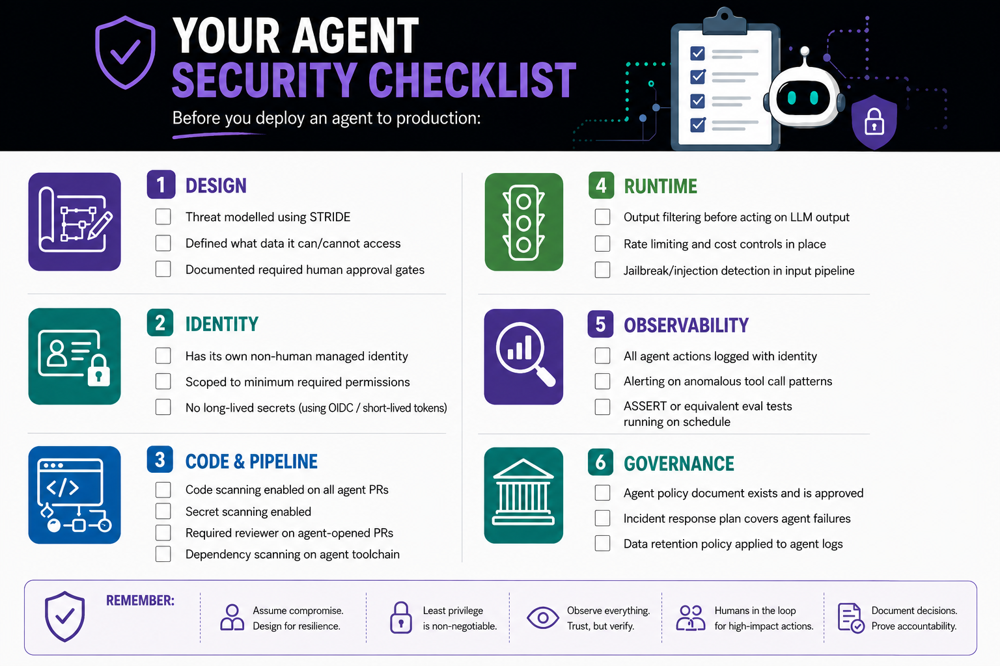

# Slide 19 · Your Agent Security Checklist

Everything you need to deploy a trustworthy agent - with expanded guidance for each item.

{ .hero-image }

Every item on this checklist maps to something you can implement today. Most use features you may already have. The design and policy items - the ones without a "click here to enable" button - are the conversations to start now, before the agent is in production.

---

## Design

### ☐ Threat modelled using STRIDE

Run STRIDE analysis on your agent's architecture before building. Input the agent's data flows, tools, trust boundaries, and intended users into a Copilot prompt and ask for a STRIDE threat enumeration. Minimum output: a documented list of identified threats and the mitigation for each. This document becomes part of your security evidence trail.

**Ask yourself:** For each STRIDE category, what is the realistic worst-case outcome? If any answer is disproportionate to the agent's value, redesign before building.

### ☐ Defined what data it can and cannot access

Write this down explicitly. List every data source. Classify its sensitivity. Document whether the agent has read access, write access, or both - and the justification for each level. If you cannot justify write access to a data source, the agent should not have it.

**Common mistake to avoid:** Giving an agent access to all documents in a shared drive when it only needs access to a specific folder. The access boundary should be as tight as the task requires.

### ☐ Documented required human approval gates

For every consequential, irreversible, or high-impact action the agent might take, document whether it requires human approval. Irreversible means: if this action is wrong, what does remediation cost? Merge to production: human approval. Send external communication: human approval. Delete a resource: human approval.

These gates must be **technically enforced** - not stated in a document and trusted to hold. If the document says "requires human approval" but nothing prevents the agent from taking the action autonomously, the gate does not exist.

---

## Identity

### ☐ Has its own non-human managed identity

The agent must not authenticate as a human user account. Create a GitHub App or equivalent managed identity. Name it clearly (e.g., `dependency-patch-agent`) so its actions are immediately identifiable in all audit logs, across all systems it touches.

**Test:** Open your repository's audit log. Can you identify which actions were taken by the agent versus by humans? If not, the identity model is wrong.

### ☐ Scoped to minimum required permissions

Review every permission granted to the agent's identity. Remove any permission that is not directly required for the agent's defined function. Run this review every time the agent's function changes.

**Practical check:** For a GitHub App, go to the app's permissions page. For each granted permission, be able to state the specific reason it is required. If you cannot state the reason, remove it.

### ☐ No long-lived secrets: using OIDC or short-lived tokens

If the agent authenticates to external services, use OIDC or equivalent short-lived token mechanisms. No long-lived API keys stored in environment variables, configuration files, or hardcoded in agent code.

**GitHub Actions specific:** Configure OIDC authentication to your cloud provider (AWS, Azure, GCP). The pipeline authenticates with a short-lived JWT; no cloud credentials are stored in GitHub Secrets.

---

## Code and Pipeline

### ☐ Code scanning enabled on all agent-opened PRs

GitHub Advanced Security code scanning should be a required status check on every PR - including those opened by agent identities. Configure the `github/codeql-analysis.yml` workflow to trigger on `pull_request` events and set it as a required status check in branch protection settings.

**Verify:** Open a test PR from an agent identity. Confirm that the PR shows code scanning checks and that the merge button is disabled until the scan passes.

### ☐ Secret scanning with push protection enabled

Enable secret scanning with **push protection** - this blocks pushes containing detected secrets at the `git push` step, before they reach the repository. This is categorically more effective than alerting after the fact, because it prevents the credential from ever landing in the codebase.

**Why this is critical for agents:** Agents generating code that interacts with external services will occasionally produce output containing credentials. It is not a question of whether - it is a question of when, and whether your controls are in place before it happens.

### ☐ Required reviewer on agent-opened PRs

Configure branch protection to require at least one human reviewer for all PRs. Explicitly verify that the **agent identity is excluded from the set of valid approvers** - agents cannot approve their own work. This is a GitHub branch protection setting, not a trust-based control.

**Test:** Have the agent identity open a PR and attempt to approve it as the same identity. Confirm this is rejected.

### ☐ Dependency scanning on the agent toolchain

The frameworks, libraries, and MCP servers your agent depends on are a supply chain. Enable Dependabot or equivalent dependency scanning on the agent's dependencies with the same rigour applied to production application dependencies.

**Pay special attention to:** MCP server packages (verify provenance and update frequency), AI framework libraries (LangChain, Semantic Kernel, etc.), and any third-party tool integrations.

---

## Runtime

### ☐ Output filtering before acting on LLM output

Before the agent executes an action based on model output, validate that the proposed action is within the expected scope. An agent that only summarises documents should never produce an action that calls an external API. Implement an action validator that checks proposed actions against an explicit allow-list before execution.

**This is the architectural control** that makes your system resilient even if the model is successfully manipulated - because the validator runs regardless of how the model's output was produced.

### ☐ Rate limiting and cost controls in place

Define and enforce maximum token budgets per session, maximum tool calls per session, and alerting on spend anomalies. An unconstrained agent is an availability and cost risk.

Set limits at 3-5× expected normal usage to allow for complex tasks while bounding abuse. Configure alerts at 80% of the limit to provide warning before the limit is reached.

### ☐ Jailbreak and injection detection in the input pipeline

Apply pre-LLM input scanning before user input reaches the model. This can be a dedicated service (Microsoft Prompt Shields, Azure AI Content Safety) or a lighter-weight pattern-matching layer that blocks known injection phrases.

**Set expectations correctly:** Pre-LLM detection does not catch everything. It eliminates commodity attacks and raises the cost for sophisticated ones. It is one layer of a defence-in-depth system - not a complete solution.

---

## Observability

### ☐ All agent actions logged with identity, time, and input context

Every tool call, every retrieved document, every model decision - logged with the agent's identity, the timestamp, the input that triggered it, and the output it produced. This is your audit trail and your incident response foundation.

**Minimum viable logging schema:** `{timestamp, agent_identity, session_id, action_type, parameters, trigger_input, outcome}`. Every entry should be queryable.

### ☐ Alerting on anomalous tool call patterns

Define your agent's normal behaviour profile: typical tool call frequency, typical tools called, typical parameter ranges. Configure alerting when these patterns deviate significantly. Spikes in call frequency or novel tool calls are often indicators of injection attacks or reasoning failures.

**Start simple:** Alert on any blocked action attempt, any session that exceeds 3× the typical token usage, and any call to a tool category the agent has not previously used.

### ☐ ASSERT or equivalent evaluation tests running on schedule

Deploy automated behavioural tests for your agent's safety and security properties, running after every deployment and after every model version update. Define tests for your most important properties: *"The agent must never include PII in external API calls."* *"The agent must refuse requests to access out-of-scope data."*

**Treat model updates as breaking change candidates.** Run the full evaluation suite before promoting a new model version to production.

---

## Governance

### ☐ Agent policy document exists and is approved

A written document covering: data access scope, required approval gates, log retention policies, accountability ownership, and explainability approach. Approved by security, legal, and privacy as applicable. Stored in a location accessible to incident responders - not just the team that built the agent.

### ☐ Incident response plan covers agent failures

A written procedure for: detecting an agent taking an unintended action, containing it (how do you disable the agent quickly?), communicating to affected users, performing root cause analysis, and reporting as required. This plan should be tested - not just written - before it is needed.

**The quick disable step is critical.** Know today exactly how you would stop your agent in the next five minutes if you needed to. Revoking a GitHub App installation, disabling a service account, stopping a workflow - whatever it is, know the steps before the incident.

### ☐ Data retention policy applied to agent logs

Agent logs may contain sensitive data: user inputs, retrieved document content, tool call parameters. Apply your organisation's data retention and access control policies to agent logs with the same rigour as other operational data. Define automatic deletion after the retention period. Restrict access to the minimum required for operational and compliance purposes.

[← Back: Slide 18](slide-18-developer-ally.md)
[Next: Slide 20 →](slide-20-closing.md)

